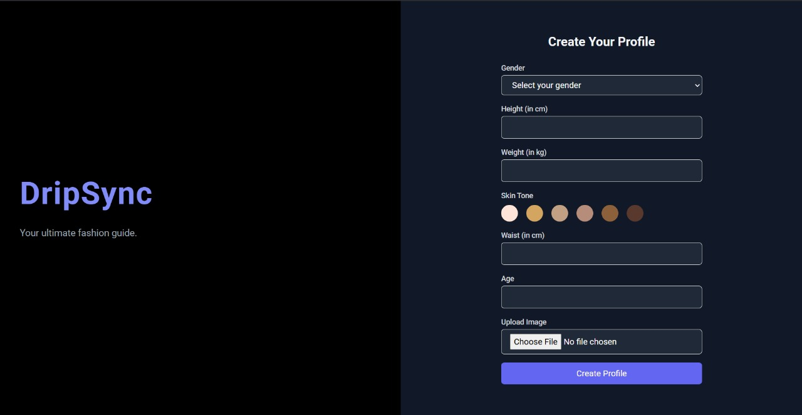
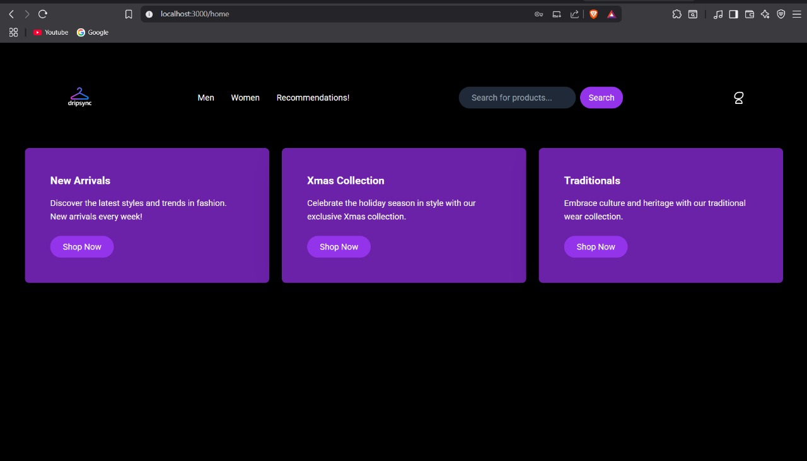
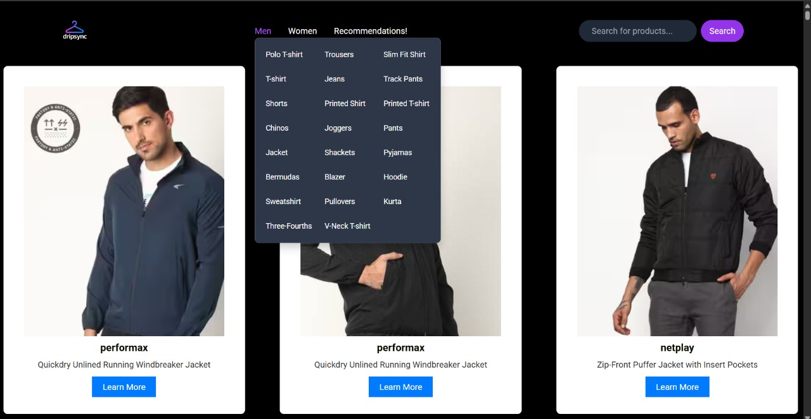
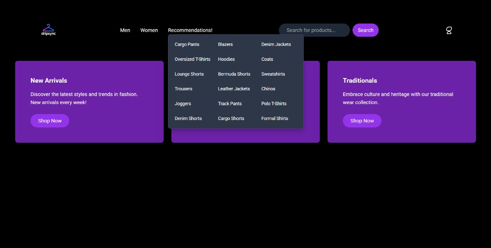
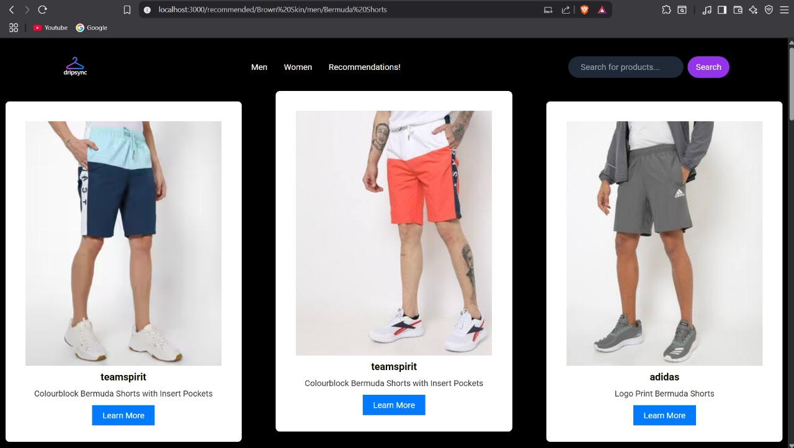
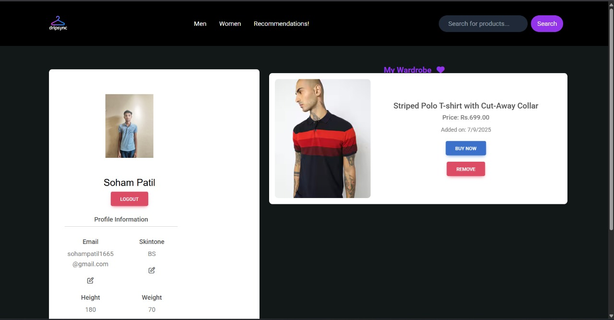
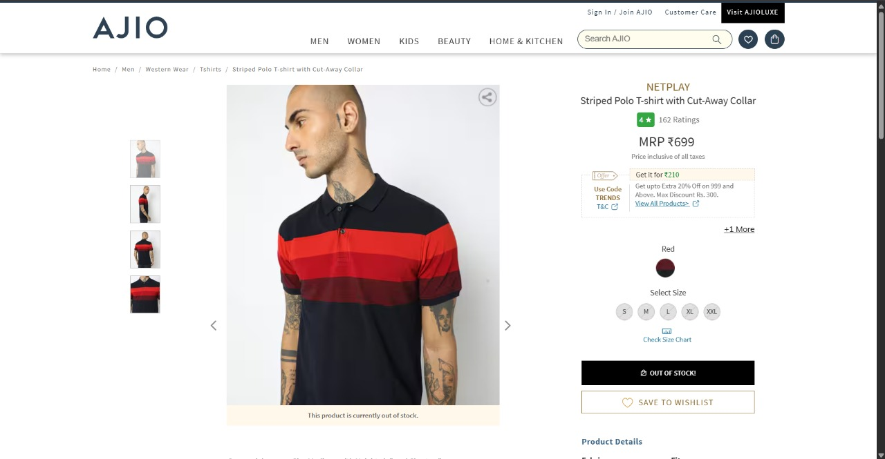
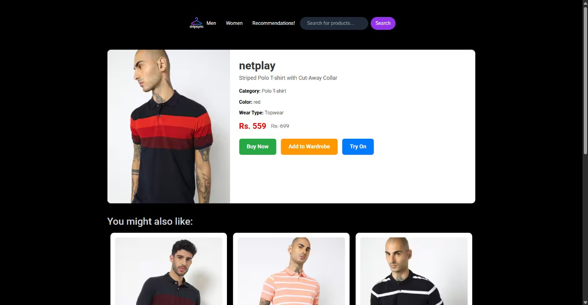
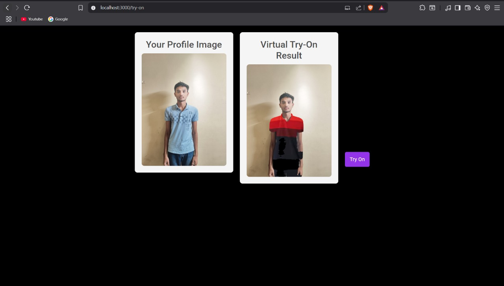

<!-- Logo -->

  

# 🧥 DripSync - Personalized Outfit Recommendation Platform

> "Try it before you buy it" → Smart virtual try-ons and outfit recommendations.

> Designed to enhance fashion e-commerce experiences by recommending outfits that align the best with the user's physical traits & preferences.

---

## 🔍 About the Project

**DripSync** is an AI-based fashion recommendation platform that helps users virtually try on outfits and receive clothing suggestions based on their physical attributes such as skin tone, height, weight, and body type.

Unlike traditional fashion e-commerce platforms that mostly rely on content-based filtering (based on wishlists or recent searches), DripSync goes a step further by incorporating visual and physical cues to make more meaningful and accurate recommendations

It aims to bridge the gap between **personal styling** and **e-commerce platforms**, making the online shopping experience more **interactive**, **personalized**, and **confident** for users.

---

## 👨🏻‍💻 Tech Stack Used

| 🔧 Layer             | ⚙️ Technologies Used |
|----------------------|-------------------------|
| 🎨 **Frontend**       | ⚛️ React.js, Tailwind CSS |
| 🐍 **Backend**        | Django Framework, 🌐 REST APIs |
| 🧠 **ML / Computer Vision** | 🐍 Python, 👁️ OpenCV, 👕 cloth-segmentation |
| 🗄️ **Database**        | SQLite3 (for development), Django ORM |
| 📂 **Product Dataset**        | Ajio fashion datasets from Kaggle containing product images, categories, colors, and URLs |
| 🛠️ **Tools & Utilities** | 📬 Postman, 🐙 GitHub, 💻 VS Code |

---

## ✨ Features

- 👤 **User Registration with Physical Details:** Height, weight, body type, and custom skin tone palette
- 📸 **Profile Image Upload:** Used for performing virtual try-ons with OpenCV
- 🎨 **Skin Tone Matching:** Users select from 6 predefined skin-tone palettes to guide color suitability

- 📂 **Two-Stage Outfit Filtering System:**
  - 🧍 **Step 1: Body-Type Based Filtering:**  
    Based on the user’s input height, weight, and measurements, the system estimates their body shape (e.g., pear, inverted triangle, rectangle, etc.) using a BMI-like logic and filters out unsuitable categories.
  - 🌈 **Step 2: Skin Tone-Based Filtering:**  
    Once a category is selected, only the outfits with colors aligning well with the user’s undertone are recommended, enhancing personal appeal 👨🏻‍🦱👨🏽‍🦱👨🏾‍🦱👨🏿‍🦱

- 👕 **Smart Outfit Recommendations:** Final list of products is curated using physical matching instead of just user search/wishlist
- 🧥 **Virtual Try-On Feature:** Garments are realistically overlayed onto the user’s profile image using pose estimation and cloth-segmentation via OpenCV

- 📦 **Wardrobe :**  Users can save preferred outfits and directly proceed to the product on Ajio for purchase

- 🔒 **User Auth & Styling History:** (Optional) Secure login to maintain profile and outfit history

---
## 📸 Project Demo

### 1️⃣ Virtual Try-On:

  <table>
    <tr>
      <td align="center"><b>User Image</b></td>
      <td></td>
      <td align="center"><b>Product Image</b></td>
      <td></td>
      <td align="center"><b>Virtual Try-On Result</b></td>
    </tr>
    <tr>
      <td></td>
      <td></td>
      <td></td>
      <td></td>
      <td></td>
    </tr>
  </table>

---

## 🖼️ Screenshots

### 1️⃣ Profile Creation

> Users enter physical details like height, weight, gender, waist size, age, and select their skin tone using a 6-color palette.  
> Most importantly, they upload a profile image which is later used for the virtual try-on process.

---

### 2️⃣ Home Page

> The homepage features a search bar and dropdowns for **Men**, **Women**, and **Recommended** sections, making navigation intuitive and structured.

---

### 3️⃣ All Categories

> A comprehensive catalog of male and female fashion categories, showcasing a large variety of outfits **without personalization** — ideal for browsing.

---

### 4️⃣ Personalized Categories (Body-Type Based)

> Based on the user’s physical attributes, the system filters the most suitable outfit categories that match their **body type** (like triangle, rectangle, etc.).

---

### 5️⃣ Skin Tone Based Product Recommendations

> Once a personalized category is selected, only those outfits that **match the user's skin tone** are recommended — ensuring the best visual harmony and confidence boost.

---

### 6️⃣ Wardrobe + Profile Page

> The **Wardrobe** acts like a wishlist/cart — where saved outfits can be revisited or purchased.  
> The **Profile page** allows users to update their image or personal details anytime.

---

### 7️⃣ Ajio Product Redirection

> When the user clicks **"Buy"** on any saved product, they are directly redirected to the original product page on **Ajio**, enabling real purchases.

---

### 8️⃣ Product Details Page

> The product page includes options to **Add to Wardrobe**, **Try On**, or **Buy Now**.  
> Also displays **"You Might Also Like"** recommendations generated using **KNN** based similarity.

---

### 9️⃣ Virtual Try-On Output

> The final virtual try-on result generated using **OpenCV**, showing the selected outfit realistically applied to the user’s image.

---

## 📊 System Architecture / Flow

  <table>
    <tr>
      <td>
        
      </td>
      <td style="vertical-align: top; padding-left: 20px; padding-top: 50px;">
        <ul>
          <li><strong>UserManager:</strong> Manages user registration and login sessions</li>
          <li><strong>User:</strong> Stores physical traits like height, weight, skin tone, etc.</li>
          <li><strong>RecommendationEngine:</strong> Filters outfits by body type & skin tone</li>
          <li><strong>VirtualTryOn:</strong> Performs realistic cloth overlay using OpenCV</li>
          <li><strong>Outfit:</strong> Contains product attributes like color, type, image</li>
          <li><strong>Database:</strong> Stores user profiles, outfits & wishlist data</li>
        </ul>
      </td>
    </tr>
  </table>

---

## 🔮 Future Scope

DripSync aims to evolve from a virtual try-on prototype to a full-fledged fashion-tech ecosystem. Some planned enhancements include:

- 🧠 **Pose-aware Virtual Try-On:**  
  Integrate **MediaPipe** or **MoveNet** to detect the user's pose in real-time, enabling better alignment and realistic try-ons even when body postures differ from the product model.

- 🧳 **User’s Personal Wardrobe Integration:**  
  Allow users to upload and manage their **real-life clothing inventory** — tops, jeans, shoes, etc.  
  This acts like a **digital closet**, helping users visualize outfit combinations using AI.

- 🗓️ **What-I-Wore Calendar (Inspired by LeetCode Streaks):**  
  A smart calendar that tracks daily outfit history — letting users recall what they wore on specific days and avoid repetition.

- ♻️ **AI-Based Outfit Reuse Suggestions for Sustainability:**  
  Using wear history, detect underutilized clothes and suggest stylish combinations from the user’s wardrobe — promoting a **sustainable fashion lifestyle**.

- ☁️ **Cloud Integration & Mobile App Support:**  
  For large-scale deployment, user accounts and image processing can be shifted to cloud platforms like AWS/GCP, with a companion mobile app to allow on-the-go outfit planning.

## 🙌 Credits & Acknowledgements

- 👨‍💻 This project was developed as part of an academic initiative to explore the intersection of **AI**, **Computer Vision**, and **Fashion E-commerce**.
  
- 🤝 Special thanks to **Sagar Madane**, founder of a local t-shirt brand (**BOKA**), who reached out showing interest in adopting DripSync’s personalized outfit suggestion system to improve his customer experience.

> 💌 Here's an excerpt from his message:
>  
> *"I think a personalized outfit suggestion platform could be a game-changer in helping my customers find the right styles and colors that work for them... I’d love to see how it could help improve my customer experience and stand out in the market."*

- 🎓 Scholarly reference datasets from **Kaggle** and various body type classification resources were used for simulation and demo purposes.

- 💡 Inspiration and architectural design refined with insights from academic research papers and open-source virtual try-on studies.

---

📌 *This project is open for collaborations or discussions — feel free to connect via [GitHub](https://github.com/Somzee5) or [LinkedIn](https://www.linkedin.com/in/soham-patil-344aa1264/)!*

